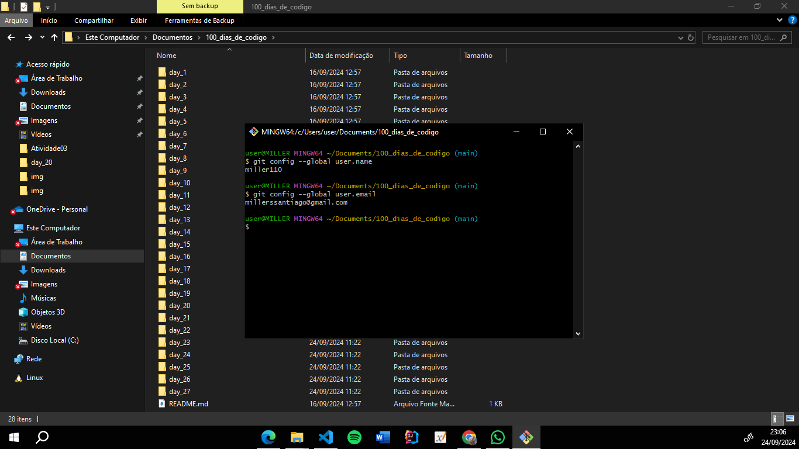

# Utilize o GIT com terminal git bash para víncular a conta do GitHub e versionar a partir daí

#### 1º Abra o Gitbash e digite o seguinte comando: "git config --global user.name 'seu_usuario'. "   Obs: seu usuário deve ser o mesmo da sua conta do Github.

#### 2º Agora digite esse comando: "git config --global user.email 'seu_email'. "  Obs: seu email deve ser o mesmo da sua conta do Github.

#### 3º Para confirmar que o seu nome de usuário e email foram vinculados corretamente, digite os comandos da imagem abaixo:
