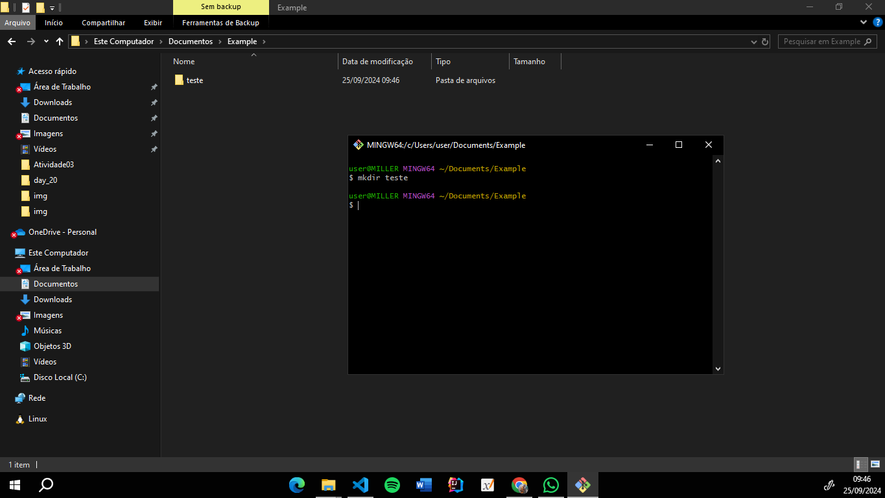
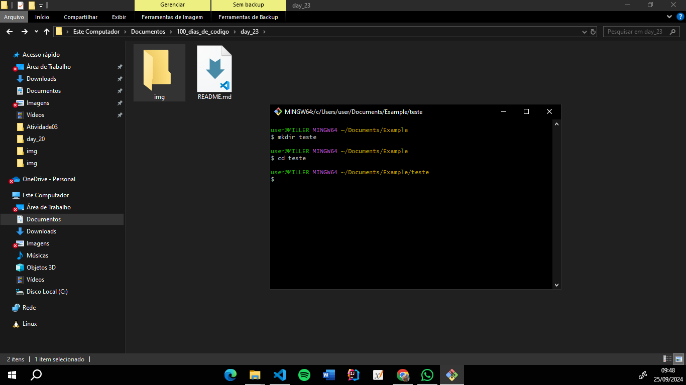
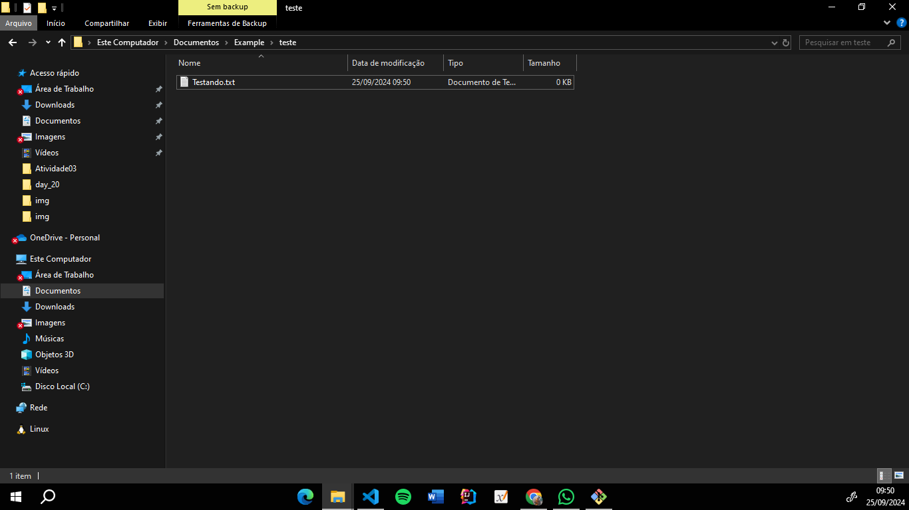
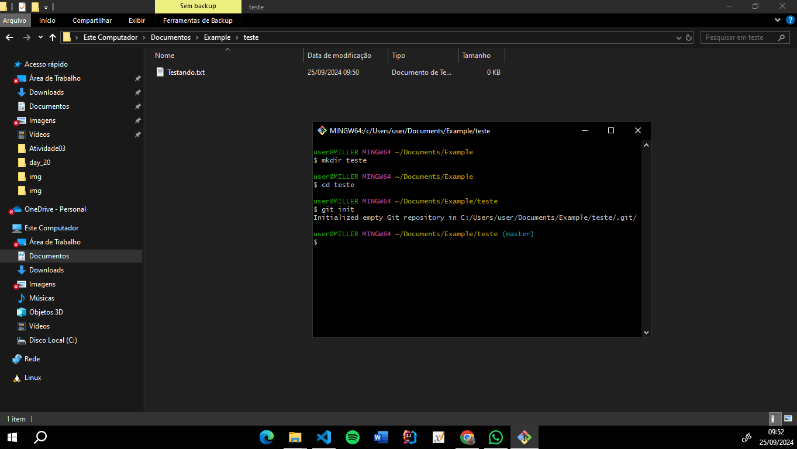
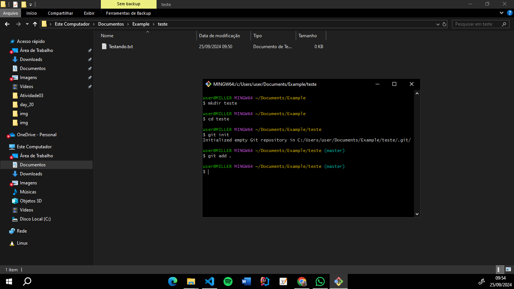
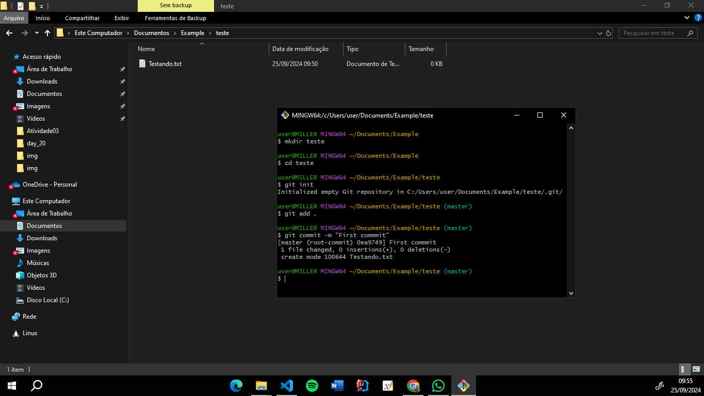
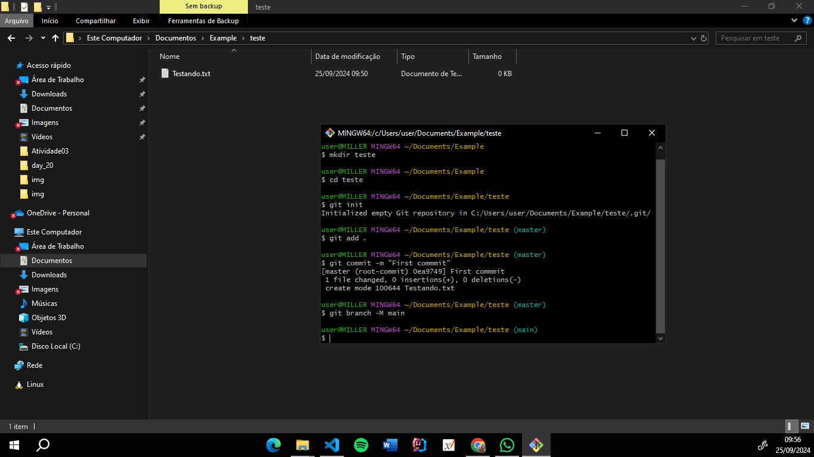
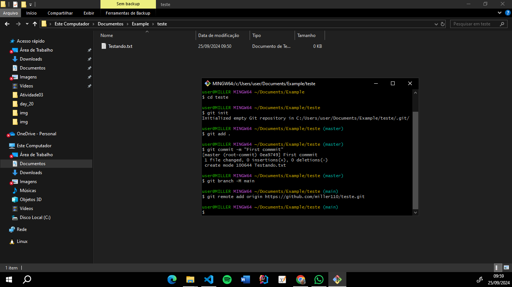
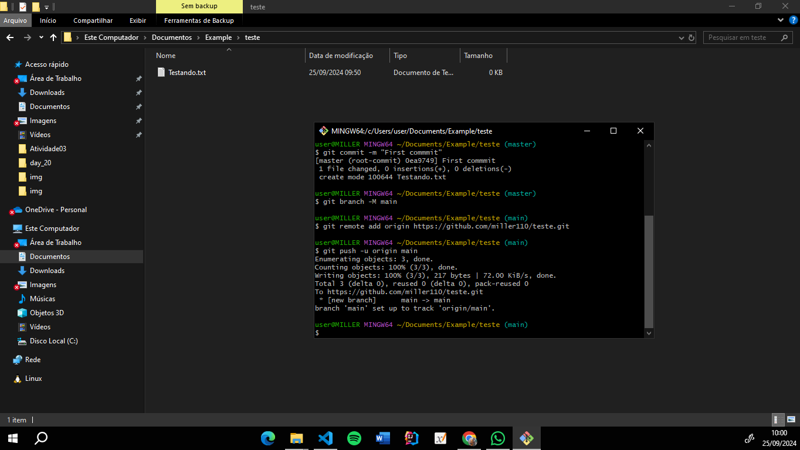
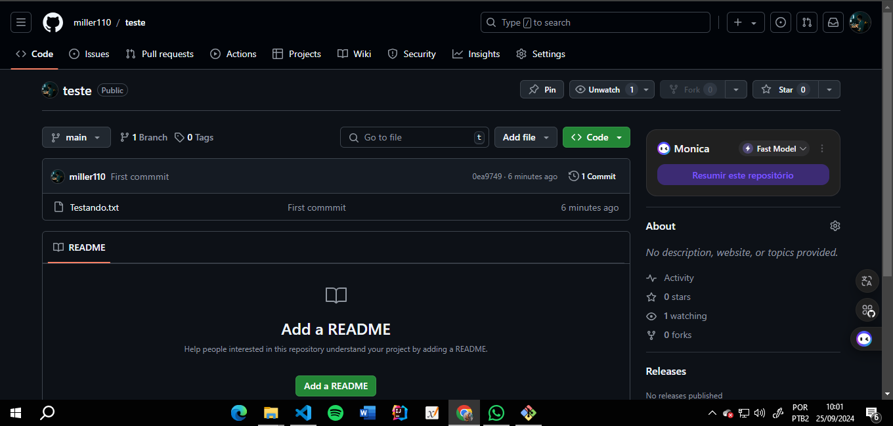

# Trabalhando com o terminal git bash, utilize uma pasta/projeto exemplo para realizar um commit e push

#### 1º Abra o Gitbash e crie uma pasta qualquer com o seguinte comando: "mkdir nome_da_pasta"

#### 2º Digite o comando "cd nome_da_pasta"

#### 3º Crie qualquer arquivo dentro da pasta criada

#### 4º Inicialize o Git com o seguinte comando: "git init"

#### 5º Adicione o arquivo criado para preparar o commit. Digite o seguinte comando: "git add ."

#### 6º Agora digite "git commit -m "First commit" para salvar as mudanças

#### 7º Se a sua branch estiver como 'Master' digite o seguinte comando para trocar: "git branch -M main"

#### 8º Caso o projeto ainda não esteja conectado a um repositório remoto, digite o seguinte comando: git remote add origin "https://github.com/seu_usuario/seu_repositorio.git"   Obs: certifique-se que o repositório já foi criado no GitHub e substitua no link mostrado acima o "seu_usuario" pelo seu nome de usuário e "seu_repositorio" pelo nome do repositório

#### 9º Por fim, envie as mudanças para o repositório remoto utilizando o comando: "git push -u origin main".

