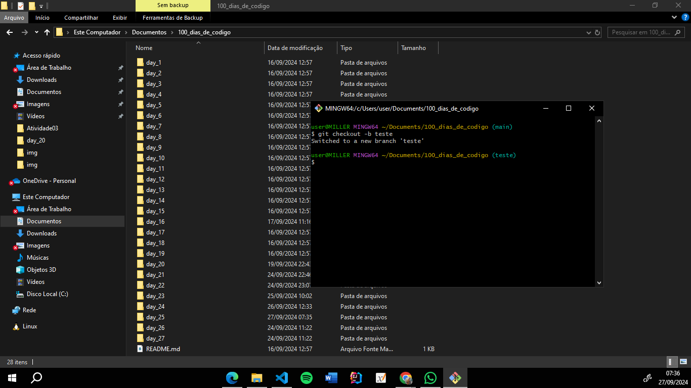

# Crie uma branch em seu repositório, discuta sobre suas funcionalidades, intuitos e formas de utilizar.

#### 1- Para criar uma nova branch em seu repositório digite o comando: "git branch -b nome_da_branch"

#### Usar branches nos ajuda a manter o código organizado, seguro e pronto para colaboração. Cada branch é um espaço independente onde podemos desenvolver novas funcionalidades, corrigir erros ou até mesmo experimentar, sem impactar a versão principal projeto. E finalmente quando o trabalho estiver pronto, podemos facilmente integrá-lo ao código principal.

