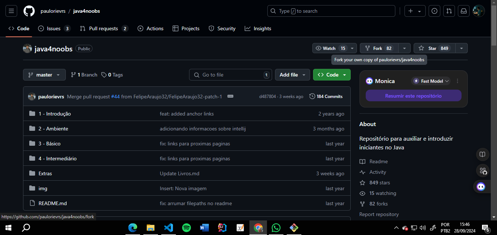
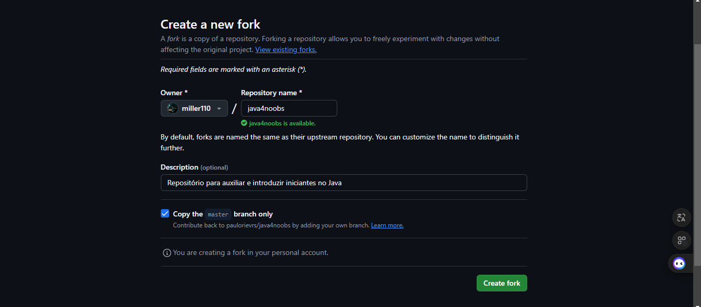
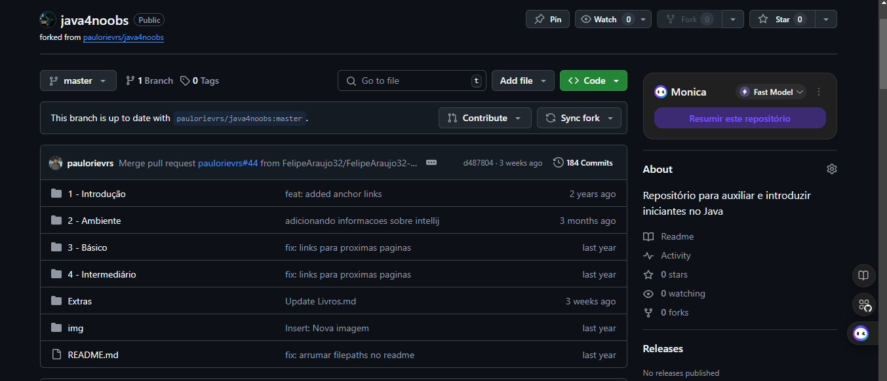

# Crie um Fork de algum repositório de terceiros através do GitHub, discuta possibilidades com esse comando.

#### 1- Escolha o repositório ao qual irá fazer o fork

#### 2- Clique em "Create fork"

#### 3- Fork feito ✅
