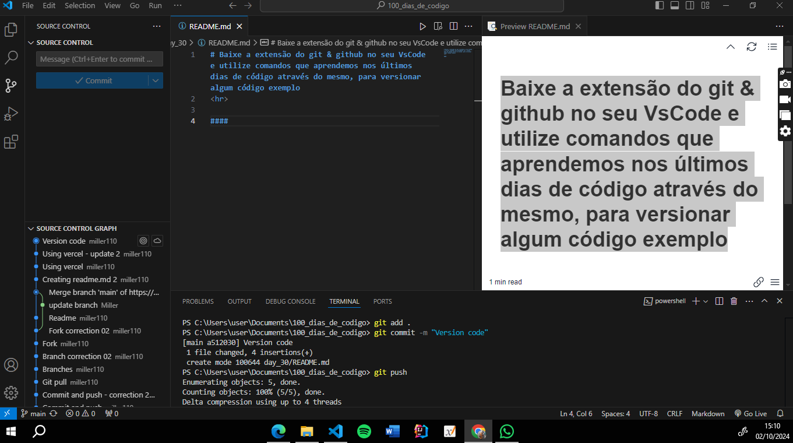
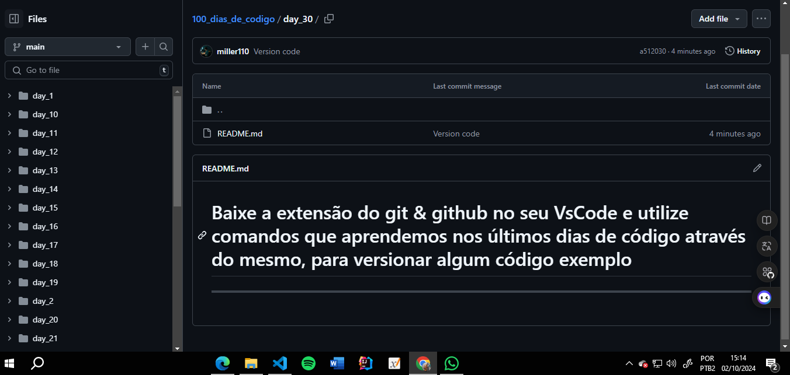

# Baixe a extensão do git & github no seu VsCode e utilize comandos que aprendemos nos últimos dias de código através do mesmo, para versionar algum código exemplo

#### Abra o VScode, segure as teclas "CTRL" e "J" para abrir o terminal. Logo após digite os comandos da imagem abaixo

#### ✔️
