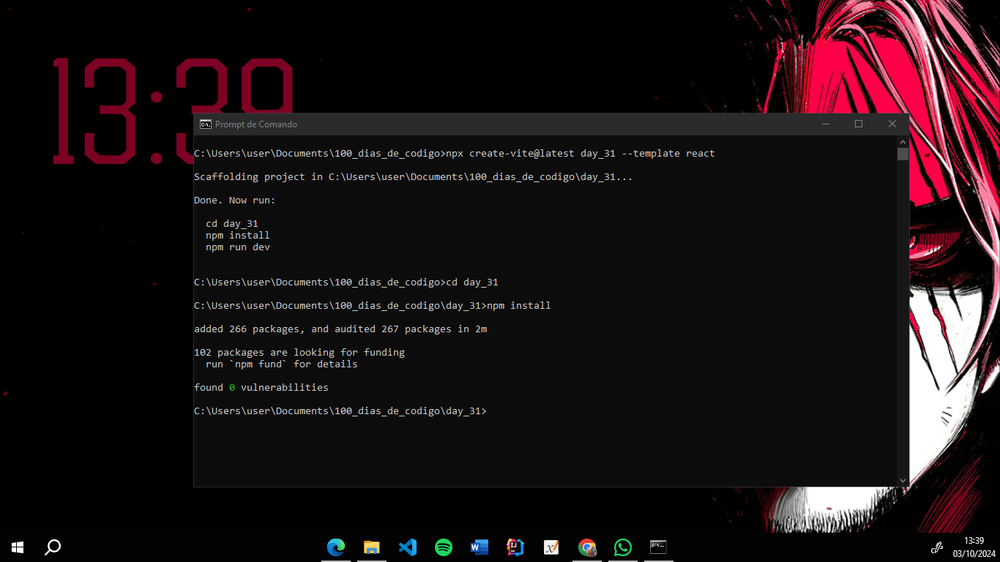
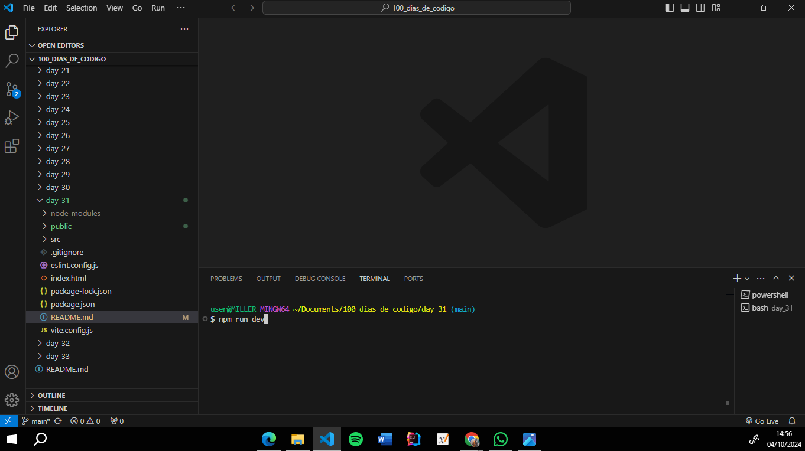
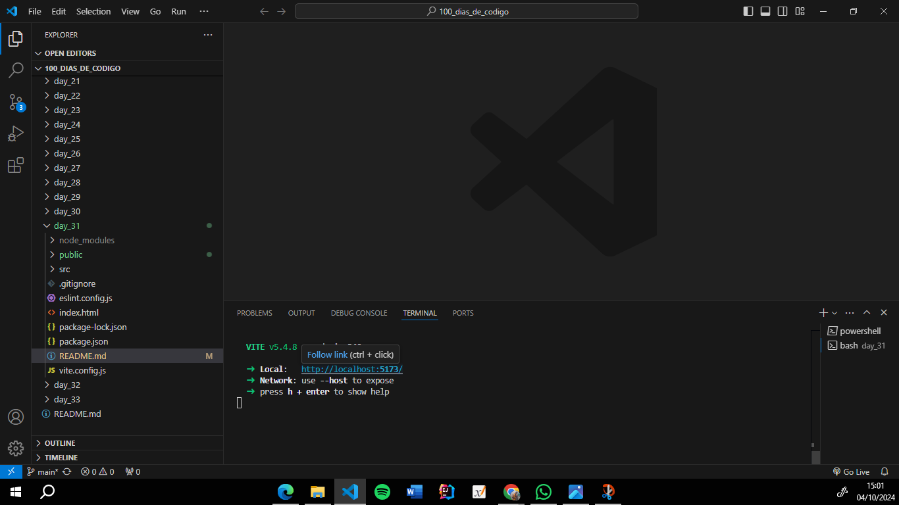

# React + Vite

#### Instale o Node JS e pesquise sobre a criação de um projeto React com Vite, dê os primeiros no desenvolvimento do projeto através da criação do mesmo, via terminal

#### 1- Digite todos os comandos que foram digitados na imagem abaixo

#### 2- Abra o projeto com o VSCode e abra o terminal digitando 'CRTL' e 'J'. Logo depois digite o comando da imagem abaixo

#### 3- Aperte 'CTRL' e clique no endereço para abrir a aplicação
