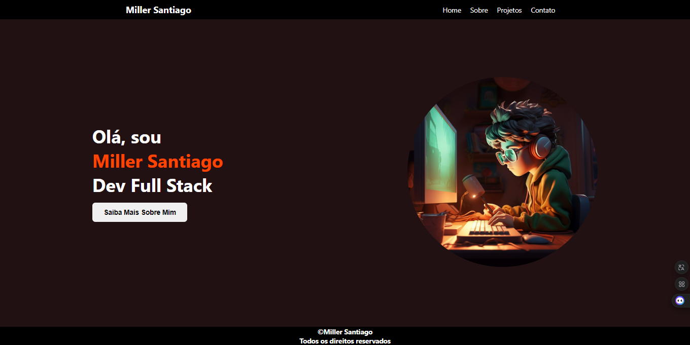

# React + Vite

#### Crie dentro da pastas src de sua estrutura, a pasta components e popule ela com um componente de exemplo, lembre-se de renderizar o mesmo em tela importando-o e utilizando-o app

