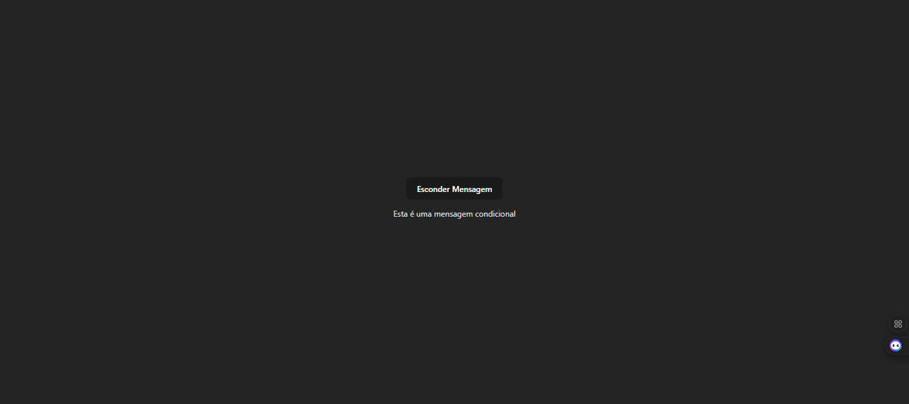

# React + Vite

#### Utilize o hook useState do React para criar uma variável de estado booleana vínculada diretamente à renderização de um componente, quando ela for true o componente é renderizado, quando false o componente não é renderizado em tela

