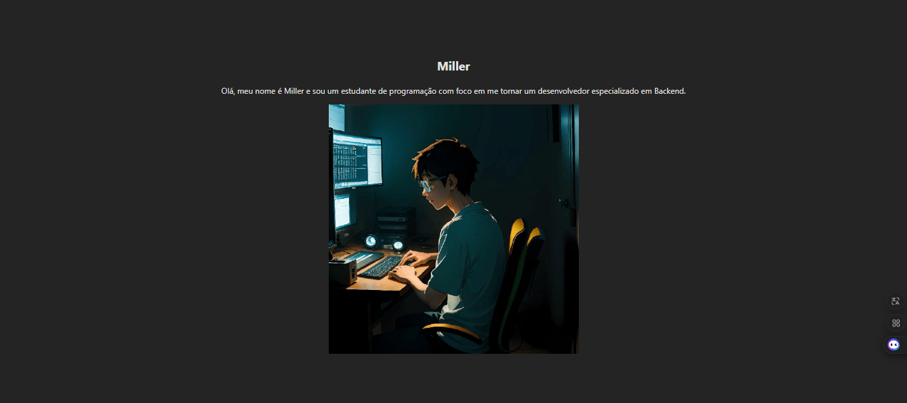

# React + Vite

#### Crie um novo componente em seu projeto React, torne-o responsável por consumir uma API externa com a biblioteca axios, a API à ser consumida deve ser do GitHub. O componente quando renderizado deve exibir os dados do perfil do github da pessoa em nossa página web do projeto

