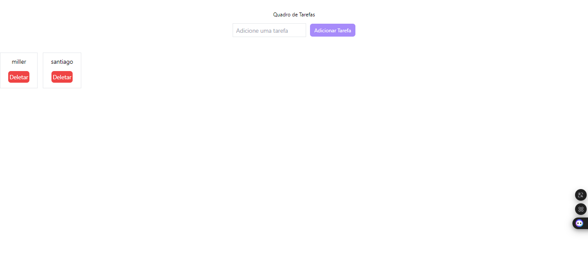

# React + Vite

## Quadro de Tarefas em React – Parte 3

#### Para concluir o projeto, crie um último componente referente ao quadro de nossa aplicação, onde as tarefas adicionadas pelo usuário serão listadas, lembre-se de manter a comunicação entre os componentes usando props. Adicione também ao projeto um botão de deletar em cada uma das tarefas, para a funcionalidade de apagar uma tarefa específica/concluída.

