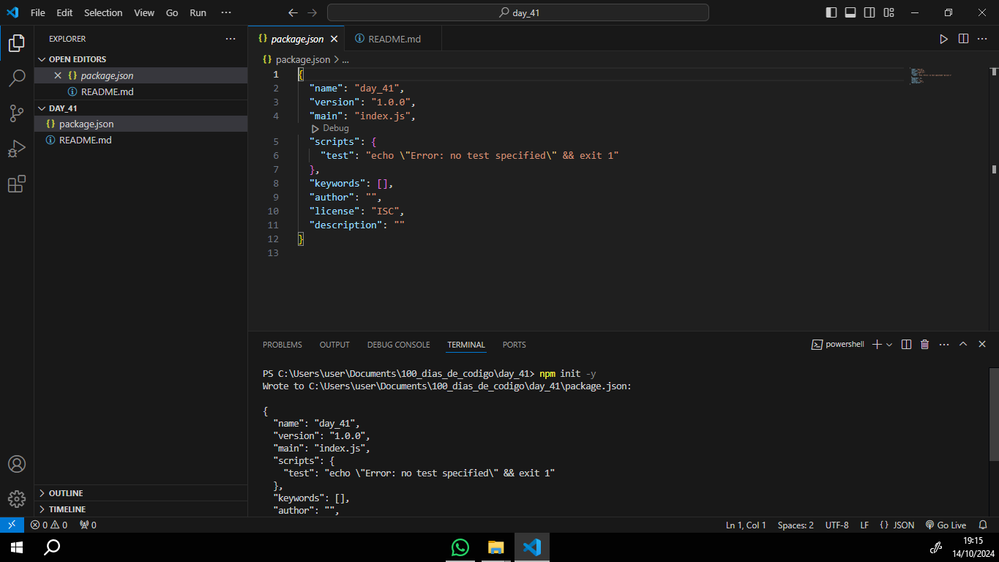

# Instalação e Inicialização do Node JS

#### Instale o Node JS no seu computador, caso não tenha. Inicialize um projeto com node utilizando no terminal o comando npm init -y para começar a estruturar seu primeiro servidor backend

