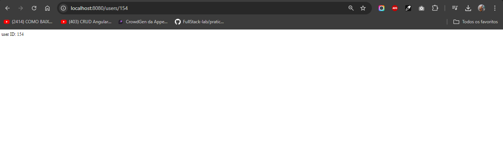

# Implementando as rotas

#### Continue explorando o express, framework do node para criar diferentes rotas na sua aplicação, seja criativo na criação de rotas relacionadas ao tipo de projeto que seu backend vai atender. Dica: pense em fazer seu servidor backend para atender um projeto frontend

