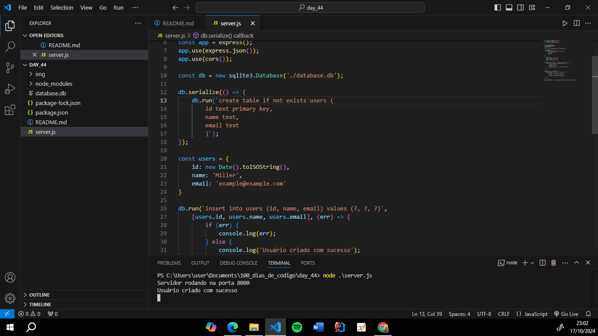
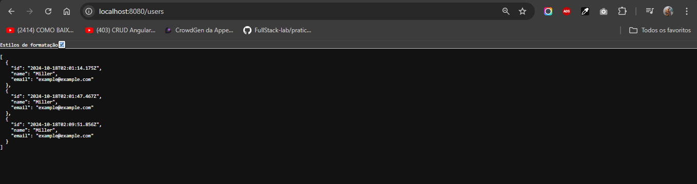

# Utilizando SQLite para criar uma tabela

#### Utilize o banco de dados SQLite no VSCode, integrado ao seu servidor Node JS para simular um fluxo de conexão backend + banco de dados, crie uma tabela no SQLite.

