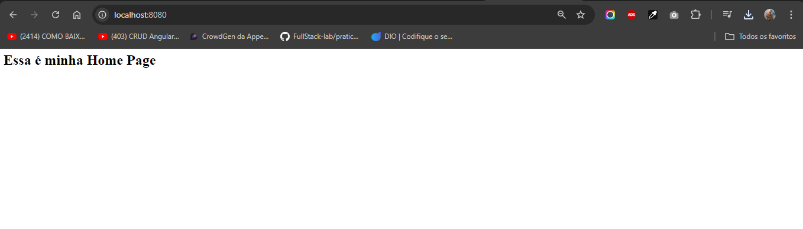

# Estruturando um projeto Node + Express do zero

## Para continuar aprofundando os conceitos cobrados até aqui, inicie novamente do zero uma estrutura backend com node js e express, lembre-se, comece a estrutura com o comando npm init -y. A partir daí instale dependências, crie rotas da API, crie regras de negócio e controladores em seu código para dar funcionalidade ao servidor backend, pense em um projeto específico em mente

