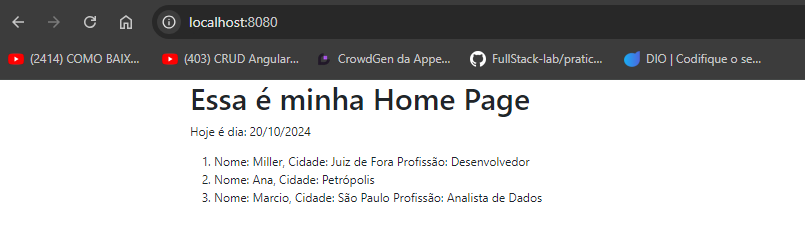

# Modelagem/Renderização com Loops e Condicionais

## Utilize o frontend para utilizar do conceito de renderização condicional, porém, utilize o servidor backend para obter a informação necessária refente ao componente condicional ser renderizado ou não. Utilize instruções condicionais (IF, SWITCH) e estruturas de repetição (FOR, WHILE) para manipular e iterar sobre dados do backend em nosso frontend

